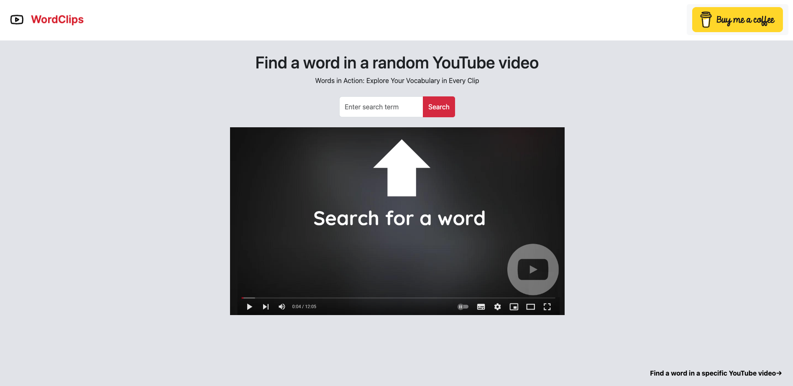
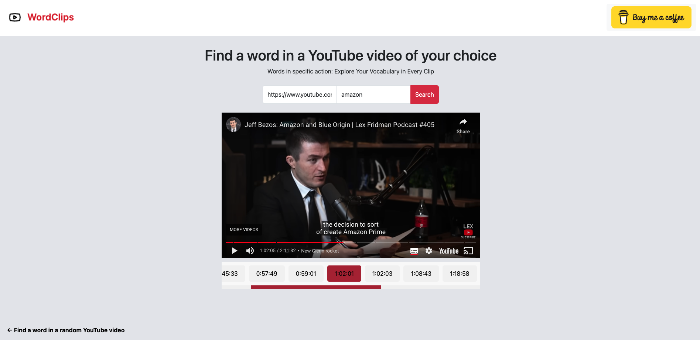

# WordClips

URL: [https://wordclips.org/](https://wordclips.org/)

WordClips is a web tool which helps you find a: 
- Find a word in a random YouTube video
- Find a word in a YouTube video of your choice

## Use cases: 
1. **Language Learning:**
   - Learn new words and phrases by exploring random YouTube videos.
   - Search for specific words in videos related to language learning to see how they are used in context.

2. **Content Creation:**
   - Find inspiration for writing by discovering new and interesting words in various video content.
   - Generate creative ideas for content creation based on words found in random videos.

## Tech stack
- Frontend (React)
- Backend (Node.js)
- Database (Firebase)

## Building process
This is a pet project of mine to go through the full process of building a fullstack app and actually deploying it. The primary goal was to gain insights into Firebase deployment and simultaneously create a tool with practical utility.

## How do you get the transcripts?
Youtube APIs somehow dont have support for getting youtube transcripts in bulk. I found a python library called [youtube-transcripts-api](https://pypi.org/project/youtube-transcript-api/) which made this project possible. I later found out that there is also an npm package [youtube-transcripts](https://www.npmjs.com/package/youtube-transcript) which made this development even easier for me as my backend is Node.js based. So shoutout to above two projects. 

## Challenges along the way: 
1. **API responses were extremely slow:**
- During the project building, I had to completely reorganize the structure of database to bring down the time to get API responses. Initially my database was structured in a way where I had to first load entire collection and then query it, based on a searchTerm. Now, each `documentId` is actually a word, meaning that querying is done way quicker. Beside that I introduced support for pagination. 

- To further speed this up, I could introduce word indexing. Firebase itself does not have built-in support for word indexing, but it does integrate with tools that do that. Meaning that would be potential future improvement.

2. **Mobile responsiveness:**

- Initially I did not opt into any CSS libraries as I wanted to have as little dependancies possible. As soon as I tried to optimize my app in a way that it is also usable on phones, I realized that this was a stupid idea. I therefore introduced Bootstrap and rewrote my frontend app quite a bit. 

## Design

For design inspiration I have to give a shoutout to [v0](https://v0.dev/), which is a generative user interface system by Vercel powered by AI. Even though I later decided not to opt in to shadcn/ui and Tailwind CSS libarires that they use, I did use their AI generated design as an inspiration for this project. Here you can see the design generated by v0: [https://v0.dev/t/9670oQWRukC](https://v0.dev/t/9670oQWRukC). 

## Improvements: 
- Implement word indexing, possibly through Algolia.
- Expand video database for a more comprehensive search.
- Introduce the ability to search "by term."
- Incorporate predictive search functionality.
- Enhance the "Find a word in a random YouTube video" page with a grid view.